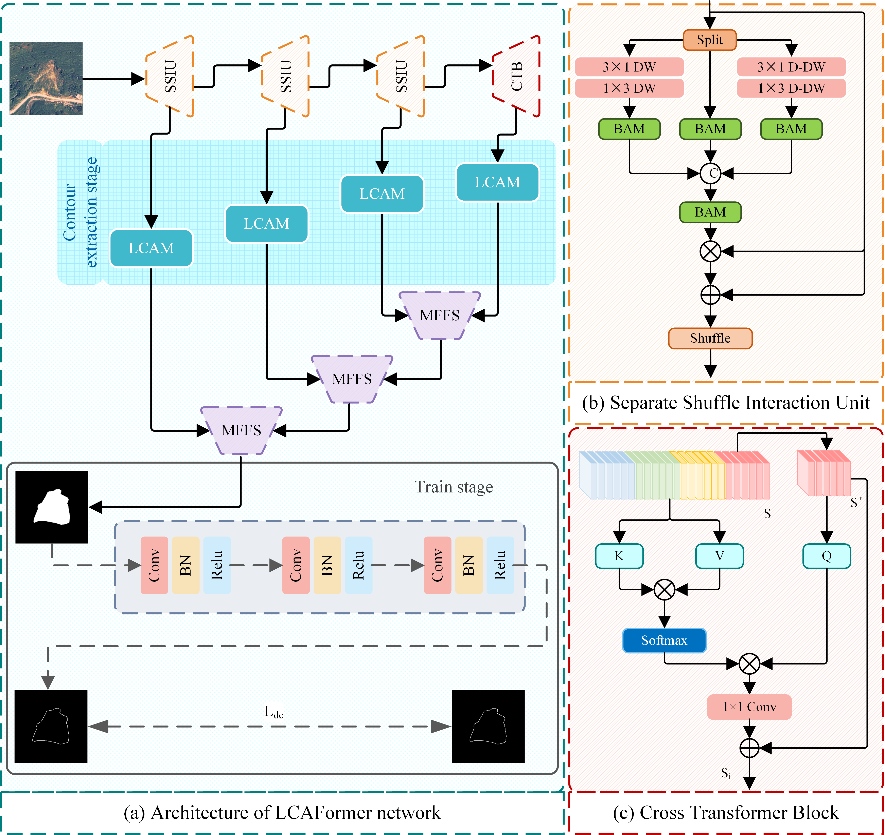
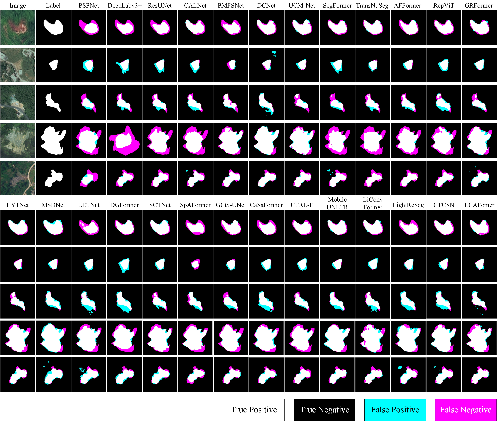
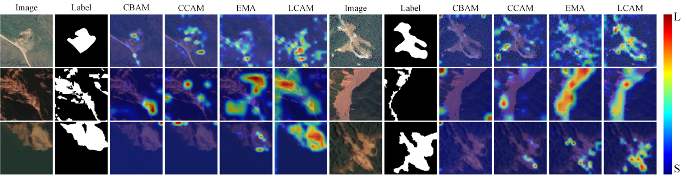

# <p align=center>` LCAFormer: Linear Contour Attention Transformer Network for Lightweight Landslide Detection`</p>

### 1. Overview

In remote sensing imagery, landslides often occur in mountainous terrain where the textures and colors of the landslide and the surrounding landscape are similar. This makes it difficult to accurately delineate the boundaries of the landslide and effectively suppress background interference. In this paper, a Linear Contour Attention Transformer (LCAFormer) model is proposed. By leveraging the complementary characteristics of Convolutional neural networks (CNNs) and Cross-transformer, the model effectively captures both global and local feature information. In the contour extraction stage, a linear contour attention mechanism (LCAM) is used to model the variability of contours across features at different scales. In addition, a multi-feature fusion sampling (MFFS) module is introduced, which restores the resolution of feature maps globally and facilitates the full integration of multi-scale features through a self-attention sampling fusion strategy, further enhancing detection accuracy. LCAFormer, with 1.51M parameters and an inference speed of 2.17G, outperforms 25 lightweight landslide detection models on three landslide datasets, achieving mIoU values of 82.70%, 68.84%, and 90.82%, respectively. Its performance meets the requirements for hardware deployment and can be applied to landslide detection tasks in future work.

<p align="center">
     <br />
</p>

### 2. Usage
#### 2.1 Dataset
+ Prepare the data:
    Download the change detection datasets from the following links. Place them inside your `data` folder.

  - [`Bijie`](http://gpcv.whu.edu.cn/data/Bijie_pages.html)
  - [`Landslide4Sense`](https://github.com/iarai/Landslide4Sense-2022))
  - [`Luding`](https://doi.org/10.1109/TGRS.2023.3321716)

- Crop Bijie and Luding datasets into 256x256 patches, Landslide4Sense dataset into 128x128 pathches 

#### 2.2 Setting up conda environment
+ Prerequisites for Python:
    - Creating a virtual environment in terminal: `conda create -n LCAFormer python=3.8`
    - Installing necessary packages: `pip install -r requirements.txt `
      
#### 2.3 Installation
+ Clone this repo:
    ```shell
    git clone https://github.com/yaoshuang-yaobo/LCAFormer.git
    cd LCAFormer
    ```

#### 2.4 tran & test & evaluation
+ Train/Test:
   - `train.py`
   - `test.py`
   - `evalution.py`
   - 
### 3. Change Detection Results
<p align="center">
     <br />
    Visualization results of LCAFormer with other models on the Bijie datasets.
</p>

<p align="center">
     <br />
   Heatmap visualization for various attention mechanism.
</p>
